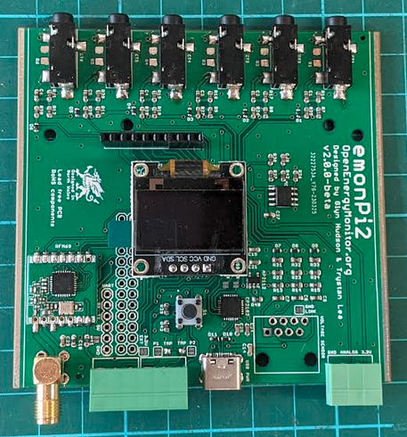

# emonPi2

The emonPi2 is an energy monitor that can monitor up to 6 AC circuits using CT sensors and the OpenEnergyMonitor emonVs voltage sensing unit. It consists of a measurement board that sits on top of a RaspberryPi. The measurement board features the new versatile Microchip AVR128DB348 microcontroller - responsible for sampling the current and voltage waveforms and calculating the power and energy values. The RaspberryPi provides full local data logging and visualisation capability.

**Features**

- 6 CT sensor inputs (333mV voltage output CT's)
- RJ45: 1-3 phase voltage input
- Pulse and temperature sensing input
- Micro: AVR128DB48
- MCP1501 Precision reference
- RFM69CW radio
- USB-C
- I2C 128x64 Display
- RTC I2C Breakout

### [Hardware schematic and board files](hardware)

### [Firmware](firmware)
