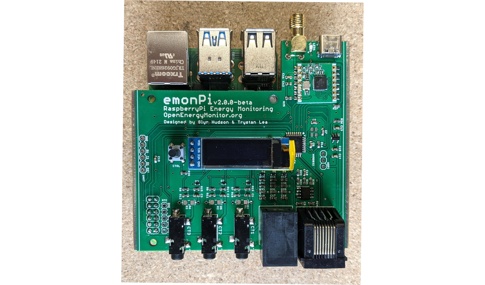
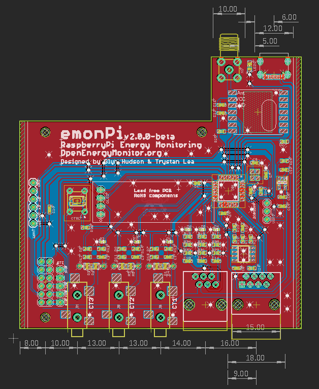

# emonPi2

The emonPi2 is an energy monitor that can monitor up to 3 AC circuits using CT sensors and the OpenEnergyMonitor voltage sensing unit. It consists of a measurement board that sits on top of a RaspberryPi. The measurement board features the new versatile Microchip AVR128DB32 microcontroller - responsible for sampling the current and voltage waveforms and calculating the power and energy values. The RaspberryPi provides full local data logging and visualisation capability.

**Features**

- 3 CT sensor inputs (333mV voltage output CT's)
- RJ11: 3 phase voltage input
- RJ45: Pulse and temperature sensing input
- Micro: AVR128DB32
- MCP1501 Precision reference
- RFM69CW radio
- USB-C
- I2C 128x32 Display
- RTC I2C Breakout

## Firmware

**[emonPi2FrontEndCM:](firmware/emonPi2FrontEndCM)** Single phase, 3 CT channel, continuous sampling, native RFM69 radio base-station firmware for the emonPi 2.

**[rf69n_rxtx_test:](firmware/rf69n_rxtx_test)** Example of receiving and transmitting RFM69 native format radio data.

Command line upload:

    sudo systemctl stop emonhub
    avrdude -Cavrdude.conf -v -pavr128db32 -carduino -D -P/dev/ttyAMA0 -b115200 -Uflash:w:emonPi2FrontEndCM.ino.hex:i 
    sudo systemctl start emonhub

