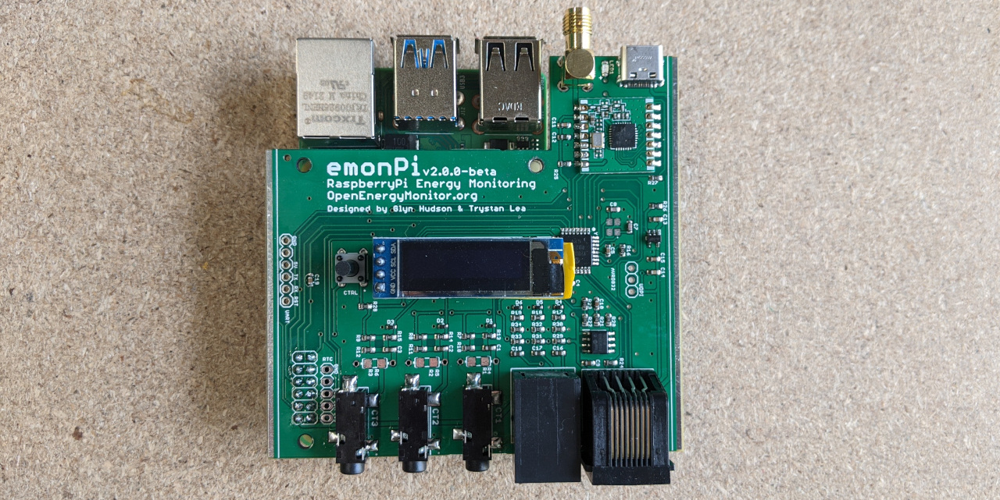

# emonPi2

The emonPi2 is an energy monitor that can monitor up to 3 AC circuits using CT sensors and the OpenEnergyMonitor voltage sensing unit. It consists of a measurement board that sits on top of a RaspberryPi. The measurement board features the Microchip AVR128DB32 microcontroller - responsible for sampling the current and voltage waveforms and calculating the power and energy values. These are then passed on to the RaspberryPi for either local data logging and visualisation or remote connectivity. The emonPi2 can also be used as a basestation to receive data from other 433Mhz radio nodes.

**Features**

- 3 CT sensor inputs (333mV voltage output CT's)
- RJ11: 1-3 phase voltage input
- RJ45: Pulse and temperature sensing input
- Micro: AVR128DB32
- MCP1501 Precision reference
- RFM69CW radio
- USB-C
- I2C 128x32 Display
- RTC I2C Breakout

### [Hardware schematic and board files](v2.0.0-beta)

### [Firmware](firmware)
