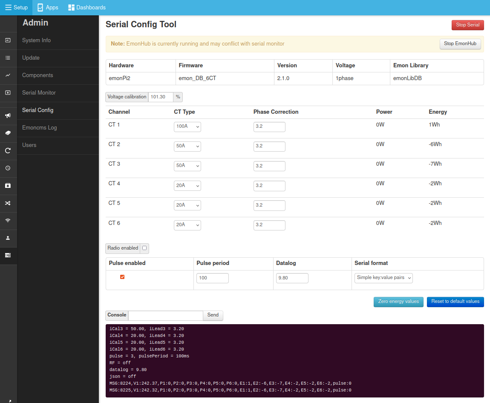

# Configuration

CT calibration is usually pre-configured in the shop as part of the order process but can be re-configured at any point using the Serial Config tool available from the emonPi2 local Emoncms interface.

- Navigate to `Setup > Admin > Serial Config`
- Click on `Stop EmonHub` to temporarily stop the EmonHub service while we perform calibration.
- Select serial port `/dev/ttyAMA0` and click `Connect`.
- After a couple of seconds the emonPi2 will print out its current configuration which will populate the interface (if it does not do this type `l` and click `Send` to reload the calibration details from the emonPi2 measurement board).
- Adjust the  CT rating to match the CT sensor that you have installed on each channel.
- Click on `Save Changes` to ensure that the new configuration is recorded such that it persists when you power cycle the board.
- When finished, click on `Stop Serial` to disconnect the serial configuration tool and then `Start EmonHub` to restart the EmonHub service.

## Directly via serial

Alternatively it's possible to configure the emonPi2 directly via serial using the arduino serial monitor or other similar tool. 
The following details the available commands and their function.

Available commands:

- **l** list the settings
- **r** restore sketch defaults
- **s** save settings to EEPROM
- **v** show firmware version
- **z** zero energy values
- **x** exit, lock and continue
- **?** show this text again
- **d\<xx.x\>** a floating point number for the datalogging period
- **c\<n\>** n = 0 for OFF, n = 1 for ON, enable current & power factor values to serial output for calibration.
- **f\<xx\>** the line frequency in Hz: normally either 50 or 60
- **k\<x\> \<yy.y\> \<zz.z\>**
  - Calibrate an analogue input channel:
  - x = a single numeral: 0 = voltage calibration, 1 = ct1 calibration, 2 = ct2 calibration, etc
  - yy.y = a floating point number for the voltage/current calibration constant
  - zz.z = a floating point number for the phase calibration for this c.t. (z is not needed, or ignored if supplied, when x = 0)
  - e.g. k0 101.3
  - k1 20.0 3.20
- **m\<x\> \<yy\>** meter pulse counting: 
  - x = 0 for OFF, x = 1 for ON
  - yy = an integer for the pulse minimum period in ms. (y is not needed, or ignored when x = 0)