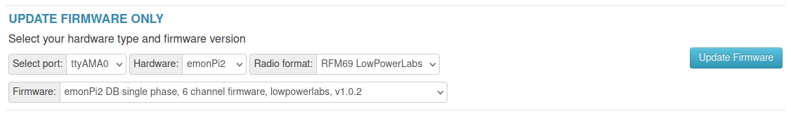

# Firmware

**Updated: 14th May 2024**

There are currently 3 pre-compiled firmware options available via both the Emoncms firmware upload tool and the command line emonupload.py firmware tool:

- **emonPi2_DB_6CT_1phase**: emonTx4 DB single phase, 6 channel firmware, pulse on analog.
- **emonPi2_DB_6CT_3phase**: emonTx4 DB three phase, 6 channel firmware, pulse on analog.
- **emonPi2_CM_6CT**: emonTx4 CM single phase, 6 channel firmware, pulse on analog. Can be used without an emonVs voltage sensor (current only).

These are now built from a set of base firmware's common to all AVR-DB hardware variants (emonTx4, emonTx5 and emonPi2) available in the [avrdb_firmware repository](https://github.com/openenergymonitor/avrdb_firmware/). The base firmware's include further options available when compiling and uploading these firmwares via the Arduino IDE including:

- **emon_DB_12CT:** emonLibDB, single and three phase, 12 channel firmware support for the expansion board.
- **Analog input:** Reading from the analog input can be enabled for all firmware variants via a `#define` compile option.

## Updating firmware

The easiest way of updating the emonPi2 firmware is to use the firmware upload tool.

1. In your local emonPi2 web interface, navigate to: `Setup > Admin > Update > Firmware`.
2. Select serial port `ttyAMA0` and then select `emonPi2` from hardware.
3. Select firmware variant as required.



## Upload pre-compiled using EmonScripts emonupload2 tool 

On the emonPi/emonBase ensure EmonScripts is updated to latest version then run emonupload2 tool 

    cd /opt/openenergymonitor/EmonScripts
    ./emonupload2.py

Select hardware then firmware version

```
Select hardware:
  1. emonTx5
  2. emonPi2
  3. emonTx4
  4. emonPi
  5. emonTx3
  6. rfm69pi
  7. rfm12pi
  8. emonTH2
  9. JeeLink
Enter number:2

Select firmware:
1. emonPi2_DB_6CT_1phase                   2.1.0      (Standard LowPowerLabs)
2. emonPi2_DB_6CT_3phase                   2.1.0      (Standard LowPowerLabs)
3. emonPi2_CM_6CT                          1.6.0      (Standard LowPowerLabs)
Enter number:
```

emonupload2 tool can also be run on any other linux computer by cloning the EmonScripts repo then running the emonupload2.py python script. Python3 required 

    git clone https://github.com/openenergymonitor/EmonScripts

## Upload pre-compiled manually using avrdude

Alternatively to upload the same pre-compiled firmware via command line on emonPi / emonBase: 

    avrdude -C/opt/openenergymonitor/EmonScripts/update/avrdude.conf -v -pavr128db48 -carduino -D -P/dev/ttyUSB0 -b115200 -Uflash:w:emonPi2_DB_6CT_1phase_v2_1_0.ino.hex:i 

Or using different computer, ensure `avrdude.conf` has `avr128db48` entry i.e DxCore see below instructions 

    avrdude -Cavrdude.conf -v -pavr128db48 -carduino -D -P/dev/ttyUSB0 -b115200 -Uflash:w:emonPi2_DB_6CT_1phase_v2_1_0.ino.hex:i 
    
You will need avrdude installed (tested on version 6.3-2017) and the custom DxCore avrdude.conf. This can be downloaded here: [DxCore avrdude.conf](https://raw.githubusercontent.com/openenergymonitor/EmonScripts/master/update/avrdude.conf).

## How to compile and upload firmware

### Compile and Upload using PlatformIO (recommended)

Clone the `avrdb_firmware` repo 

    git clone https://github.com/openenergymonitor/avrdb_firmware
    cd avrdb_firmware/emon_DB_6CT
    
Open `emon_DB_6CT.ino` in an editor and change `#define EMONTX5` to `#define EMONPI2`. 

Change any other compile options as required e.g:

- to enable analog read uncomment `#define ENABLE_ANALOG`.
    
Install PlatformIO core then to compile and upload:

    pio run -t upload

On first run PlatformIO will download automatically all the required libraries. You can also use the PlatformIO GUI. 

### Compile and Upload using Arduino IDE 

If you don’t already have the Arduino IDE it can be downloaded from here:<br>
[https://www.arduino.cc/en/software](https://www.arduino.cc/en/software)

Once you have the IDE installed, you then need to install [Spence Konde’s DxCore](https://github.com/SpenceKonde/DxCore). This can be done by first pasting the following board manager URL in Arduino IDE > File > Preferences:

    http://drazzy.com/package_drazzy.com_index.json

Then navigating to: *Tools > Boards > Boards Manager*, Select “DxCore by Spence Konde” and click Install. 


For more information on DxCore installation see: [https://github.com/SpenceKonde/DxCore/blob/master/Installation.md](https://github.com/SpenceKonde/DxCore/blob/master/Installation.md).

**Libraries**

Locate or create your Arduino Sketchbook directory (location found in Arduino preferences). If it doesnt already exist, create a directory called libraries in the Sketchbook directory and install the following libraries:


1\. Download EmonLibCM library (avrdb branch)<br>
[https://github.com/openenergymonitor/EmonLibCM/tree/avrdb](https://github.com/openenergymonitor/EmonLibCM/tree/avrdb)

2\. Download EmonLibDB library (main branch)<br>
[https://github.com/openenergymonitor/emonLibDB](https://github.com/openenergymonitor/emonLibDB)

2\. Download emonEProm library (avrdb branch)<br>
[https://github.com/openenergymonitor/emonEProm/tree/avrdb](https://github.com/openenergymonitor/emonEProm/tree/avrdb)

3\. Download RFM69_LPL library (main branch)<br>
[https://github.com/openenergymonitor/RFM69_LPL](https://github.com/openenergymonitor/RFM69_LPL)

4\. Download RFM69_JeeLib library (avrdb branch)<br>
[https://github.com/openenergymonitor/RFM69_JeeLib/tree/avrdb](https://github.com/openenergymonitor/RFM69_JeeLib/tree/avrdb)

5\. Download DxCore SpenceKonde OneWire library:<br>
[https://github.com/SpenceKonde/OneWire](https://github.com/SpenceKonde/OneWire)

**Open and edit the AVR-DB firmware**

Clone the `avrdb_firmware` repo 

    git clone https://github.com/openenergymonitor/avrdb_firmware

Open the base firmware that you wish to use in the Arduino IDE e.g `emon_DB_6CT.ino`.

Change `#define EMONTX5` to `#define EMONPI2`. 

Change any other compile options as required e.g:

- to enable analog read uncomment `#define ENABLE_ANALOG`.

**Compilation settings:**

With DxCore and the libraries installed the firmware should then compile. 

Under Tools, select the following configuration options:

- Select Board "AVR DB-series (Optiboot)"
- Select Chip: AVR128DB48
- Clock Speed: 24 MHz Crystal
- Bootloader serial port: UART3: TXPB0, RXPB1

Select Board "AVR DB-series (Optiboot)"


Select Chip: AVR128DB48


Bootloader serial port: UART3: TXPB0, RXPB1


