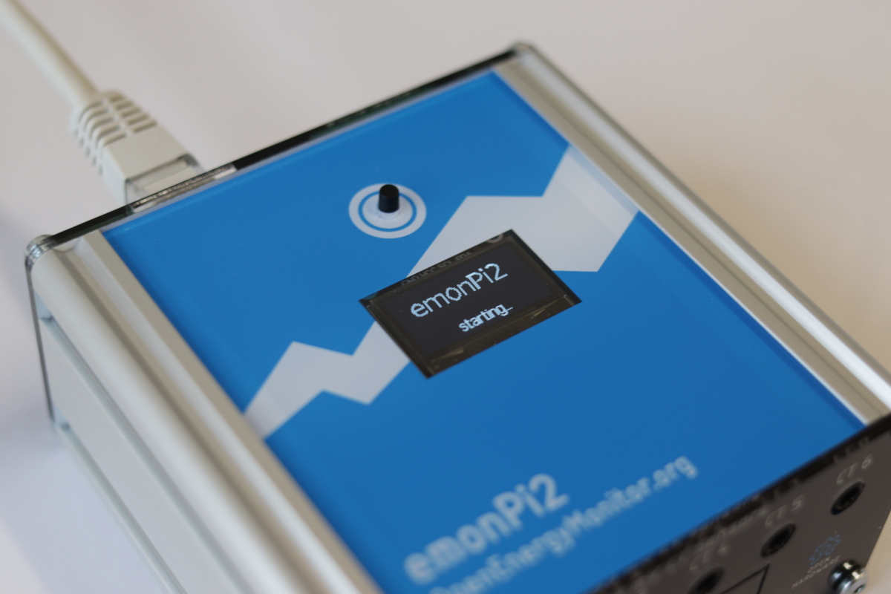
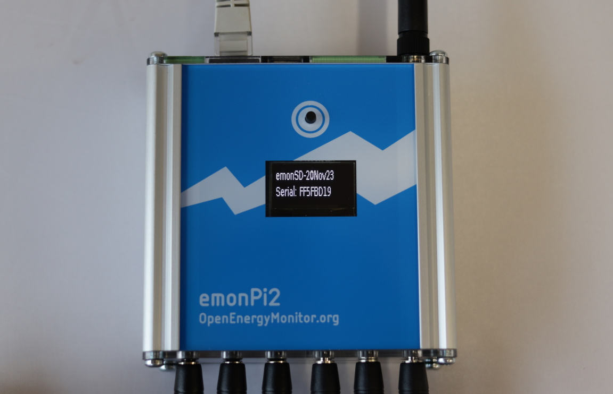
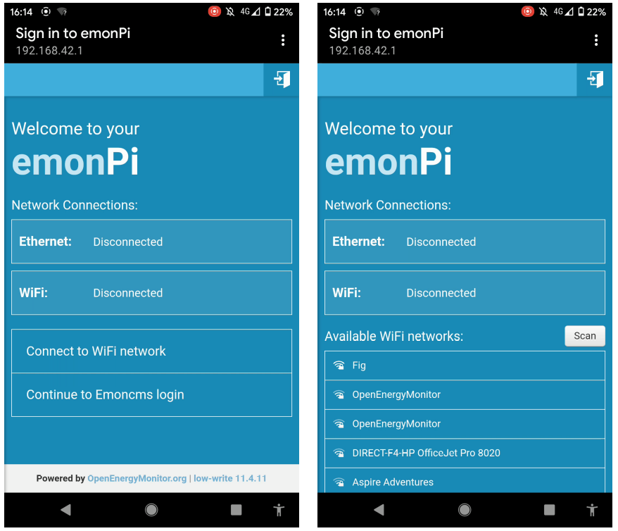
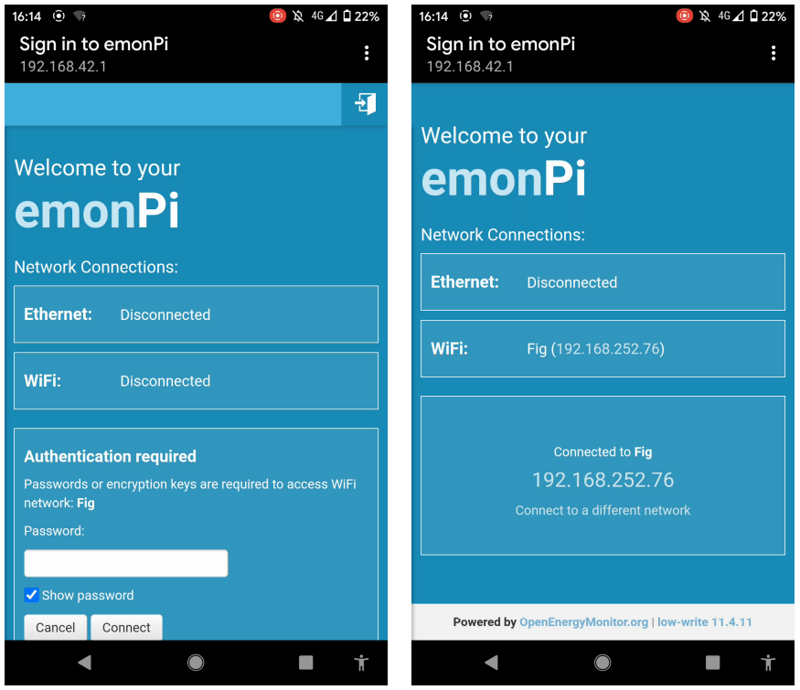
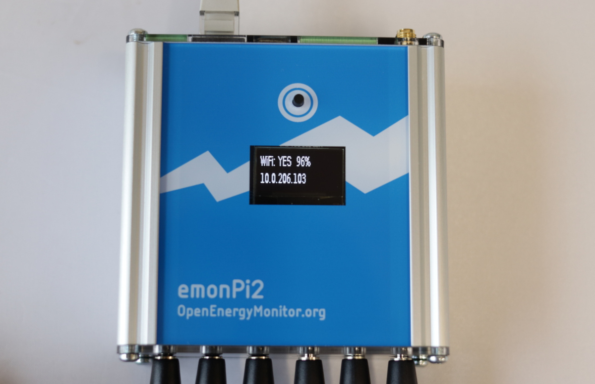
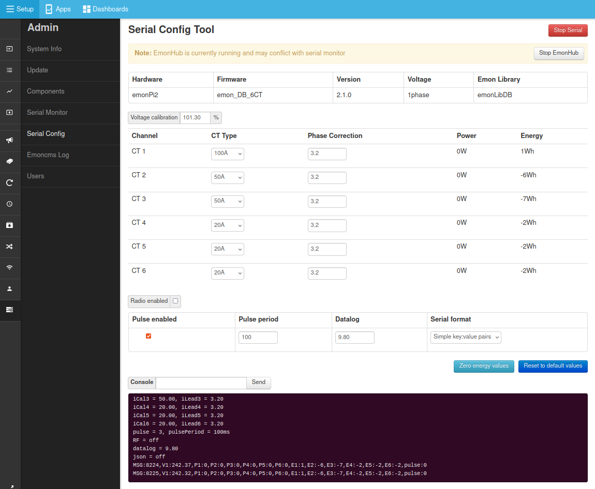

# emonPi2 Install Guide

The following guide covers installation of the [emonPi2 6x input energy monitor and integrated base-station](overview.md).

<iframe width="560" height="315" src="https://www.youtube.com/embed/XAJV5zDJF_4?si=5aG4XxaeXYWK0_xQ" title="YouTube video player" frameborder="0" allow="accelerometer; autoplay; clipboard-write; encrypted-media; gyroscope; picture-in-picture; web-share" referrerpolicy="strict-origin-when-cross-origin" allowfullscreen></iframe>


**Hardware covered in this guide:**

- [emonPi2: 6 input energy monitor](overview.md)
- [emonVs: Precision voltage sensor and power supply](voltage_sensors.md)
- Up to 6 CT sensors
- RJ45 voltage sensor and power supply cable

## Quick Start

1. Clip the CT current sensors around Live OR Neutral cable of the AC circuit to be measured (not both), note CT direction K -> L (L: Load), That’s on the Line conductor, the arrow points
away from the load on the Neutral.

2. Plug the CT current sensors into emonPi2 via 3.5mm jack plugs

3. Plug emonVs RJ45 cable into emonPi2

4. Plug emonVs into mains power via a domestic wall socket

5. (optionally) If you have the RaspberryPi 4 variant of the emonPi2 a hard wired Ethernet internet/LAN connection can be connected.

6. Switch on mains socket. The display on the emonPi2 will show `emonPi2, starting..`. On the SD card side of the case the RaspberryPi 4 indicator LED should be visible through the black face plate.

7. If using Ethernet, continue with [step 5. Connecting via Ethernet](#connecting-via-ethernet). If using WiFi, continue with [step 6. Connecting via WiFi](#connecting-via-wifi).

```{admonition} Instructions for safe use
- Clip-on CT sensors are non-invasive and should not have direct contact with the AC mains. As a precaution, we recommend ensuring all cables are fully isolated prior to installing. If in doubt seek professional assistance.
- Do not expose to water or moisture
- Do not expose to temperate above rated operating limits
- Indoor use only
- Do not connect unapproved accessories
- Please contact us if you have any questions
```


---

## Extended version

A good place to start is to assess the location where you wish to install the emonPi2, identify the circuits that you wish to monitor using the clip-on CT sensors and decide how you would like to install the emonVs voltage sensor. There are a couple of example installations given below which may provide inspiration.

## 1. emonVs installation

There are two different ways of installing the [emonVs voltage sensor](https://shop.openenergymonitor.com/power-supplies/):

**Using the mains plug supplied:** If you have a convenient socket near-by this will be the easiest and quickest option.<br>

**Direct installation:** The emonVs can be hardwired by a suitably competent person into a 6A or lower circuit protection device in the fuse board (consumer unit) or a 3A fused spur. The supplied emonVs mains power cable has a cross sectional area of 1.0mm<sup>2</sup>. This can provide a tidy installation if no socket is available and helps ensure higher monitoring uptime if sockets are at risk of being unplugged for use by other appliances.

The emonVs unit can be wall mounted using the brackets on the enclosure.

If in North America, you likely want the [3-phase version of the emonVS](https://shop.openenergymonitor.com/emonvs-3-phase-no-plug/), as this will allow you to use the split phase [firmware](firmware.md). The split phase firmware enables the most accurate power measurements.

If you plan on using an [emonTx5 with your emonPi2](../emontx5/install.md), you will likely want an [emonVs RJ45 duplicator](https://shop.openenergymonitor.com/emonvs-rj45-duplicator/) to use a single emonVs with both devices.

## 2. CT sensor installation

- Current transformers (CTs) are sensors that measure alternating current (AC).

- The emonPi2 supports a wide variety of 333mV voltage output CT sensors. We stock 20A, 50A, 100A & 200A options in the OpenEnergyMonitor shop. The physical size of these CT sensors is also roughly proportional to their current rating. For highest accuracy it's a good idea to choose CT sensors that match the rating of the circuit being monitored. As an example a 20A CT should be used for 16A or 20A circuits, a 50A CT for 32A EV chargers or 100A CT for whole house monitoring (assuming a 100A rated supply).

- CT sensors need to be clipped around the Live OR Neutral cable of the AC circuit to be measured (not both). The CT sensors have an indicated direction printed on the case `K->L`, where L is the direction of the load. That’s on the Line conductor, the arrow points away from the load on the Neutral. This will ensure the correct sign (+/-) on the power readings.

- 

- Take care not to compress the sensor with any sideways force as this can affect the accuracy of the measurement.

- The new range of CT sensors used with the emonPi2 are all voltage output CT sensors with integrated burden resistors and so are safe to clip on to the circuits that you wish to measure before plugging into the emonPi2 if that makes installation easier.

- Note the CT sensor used on each circuit, as well as the channel number on the emonPi2 that the CT is connected to, as this may be required to calibrate the emonPi2 if you are using non standard CT ratings. It's worth making a physical note of this on a label next to the emonPi2 for future reference.


```{note}
The emonPi2 requires voltage output CT sensors, it is not compatible with the old current output YHDC (blue) 100A CT sensors - unless appropriate burden resistors are installed.
```

```{tip} 
With 6 CT sensor cables and often more cable than you need, it's easy for an installation to look like a hive of wires! A little electrical trunking can go a long way to tidying it all up, allowing for excess cable to be looped back on itself.
```

## 3. emonPi2 Installation

- The emonPi2 can be wall mounted using the wall mounting kit supplied. Installation on it's side, with the aluminium side plates on the top and bottom can help reduce risk of things falling onto the sockets and can make for an easier installation in terms of CT sensor routing.

- Plug in the CT sensors, note which CT sensor is plugged into each input on the emonPi2 as each input needs to have the correct calibration applied.

- Connect the RJ45 cable (ethernet sized connector with 8 pins) from the emonVs voltage sensor and power supply to the RJ45 socket on the opposite side of the case to the CT sensor sockets. (If you have the RaspberryPi 4 variant of the emonPi2 the RaspberryPi Ethernet socket is on the same side as the CT sensors, avoid plugging the emonVs RJ45 cable into the Ethernet socket and vice versa).

## 4. Startup and display menu

With the emonPi2 powered up a simple `emonPi2 starting...` message will be printed on the display. The RaspberryPi is booting at this point which usually takes around 40 seconds: 



Once booted the display will print the SD card image version and emonPi2 serial number: 



Scroll through the display menu by pushing the button above the display. The menu items are:

1. emonSD image version and hardware serial number.
2. Time and date and uptime
3. Ethernet status (or if connected IP Address)
4. WiFi status (or if connected IP Address)
5. WiFi Access Point (AP) status and if enabled IP Address
6. Enable or Disable WiFi Access Point (press and hold for 5 seconds to change)
8. Enable or Disable SSH access (press and hold for 5 seconds to change)
9. Shutdown gracefully (press and hold for 5 seconds)

```{note}
When the emonPi2 is first powered up the WiFi Access Point is enabled for 10 minutes. Page 5 will show the WiFi Access Point as `WiFi AP: YES` followed by the access point IP address `192.168.42.1`. The access point is enabled at startup primarily for emonBase systems which do not have a push button, providing a way to configure or reconfigure WiFi during this startup window. It is possible to turn this off if prefered.
``` 

## 5. Connecting via Ethernet

If a wired ethernet connection is available and you have the emonPi2 hardware that supports Ethernet (e.g RaspberryPi 4 shop option), this does usually give the most reliable result. We recommend using shielded Etherent cable to reduce potential electromagnetic interference. Simply plug the Ethernet cable into the Ethernet port found next to the USB ports and CT sensor inputs - *NOT the RJ45 port used for the emonVs voltage sensor and power supply*.

Scroll to page 3 on the emonPi2 display to find the assigned IP address.


## 6. Connecting via WiFi

**When the emonPi2 is powered up it will create a Wi-Fi Access Point** called `emonPi`. Connect to this using password `emonpi2016`. On Android devices a captive portal option should pop up with the option to 'Sign in'. This will bring up the Wi-Fi configuration interface.

```{note}
Captive portal and the new Wifi setup interface is available on emonSD_01Feb24 or newer. You may wish to upgrade to the latest emonSD image see the emonSD download section.
```

```{note}
While captive portal generally works well on Android phones, the current software version may not always provide a consistent captive portal 'Sign in' popup on other devices and browsers. If no 'Sign in' option appears browse manually to the IP address [http://192.168.42.1](http://192.168.42.1).
```

1\. Click on 'Connect to WiFi network' to show the list of available WiFi networks. Click on the network that you wish to connect to.



2\. Enter the WiFi network passkey (often found at the back of the internet router). Click connect. Connecting to a network and relaying the status update back to the user interface typically takes around 20 seconds. Note down the assigned IP address and use this to connect to your emonPi2 once you are connected back to your home WiFi network.



```{note}
The Pi Zero 2W hardware option will usually drop the access point WiFi connection a few seconds after clicking 'Connect'. Wait a few seconds, disable and re-enable WiFi on your phone, connect to the emonPi access point again and then bring up the network configuration interface via the 'Sign in' captive portal if available. The connection status and IP address can be accessed by reconnecing to the access point in this way.
```

The WiFi IP address can also be accessed by scrolling to page 4 on the emonPi LCD:



**The emonPi2 will now present the emoncms login screen.** If the Register button is not shown, login with default account username `emonsd` and password `emonsd`. We recommend changing the default username and password from the My Account page once logged in.

## 7. EmonCMS setup

EmonCMS is the main user interface on the emonPi/base, it can be used to store and visualise data locally or just used to configure posting data to a remote server, or both.

The following guides are a useful resource, detailing how to use and make the most of the EmonCMS application:

1. Start with [emonCMS: Getting started emonPi/Base](../emoncms/intro-rpi.md), this gives a useful overview of the main parts of Emoncms to familiarise with first. It discusses the difference between local and remote logging and introduces the emonHub software tool that is used alongside Emoncms to read data from the emonPi and any other connected sensors. See also the *Setup inputs and feeds* section below.

2. The [Emoncms core concepts guide](../emoncms/coreconcepts.md) is a useful overview of terminology. What is an input, feed, device? What the difference is between the graph tool, other visualisations, apps and dashboards.

3. There are number of pages that discuss how to use the EmonCMS graph tool: [View Graphs](../emoncms/graphs.md), [Calculating Averages](../emoncms/daily-averages.md), [Calculating Daily kWh](../emoncms/daily-kwh.md), [Exporting CSV data](../emoncms/export-csv.md).

## 8. CT calibration selection

Different rating CT sensors e.g 100A, 50A, 20A etc, require differant preset calibrations.

CT calibration is usually pre-configured in the shop as part of the order process, but you may wish to double check that your calibration configuration matches the sockets that you have plugged the CT sensors into at this point.

- Navigate to `Setup > Admin > Serial Config`
- Click on `Stop EmonHub` to temporarily stop the EmonHub service while we perform calibration.
- Select serial port `/dev/ttyAMA0` and click `Connect`.
- After a couple of seconds the emonPi2 will print out its current configuration which will populate the interface (if it does not do this type `l` and click `Send` to reload the calibration details from the emonPi2 measurement board).
- Adjust the  CT rating to match the CT sensor that you have installed on each channel.
- Click on `Save Changes` to ensure that the new configuration is recorded such that it persists when you power cycle the board.
- When finished, click on `Stop Serial` to disconnect the serial configuration tool and then `Start EmonHub` to restart the EmonHub service.



## 9. Setup input and feeds

**Configure inputs by navigating to Setup > Inputs.** The emonPi2 will pop up here automatically under the `EmonPi2` node name.


**The next step is to log the input data to feeds.** Inputs are just placeholders showing the latest values sent from the emonPi2, we need to create feeds if we want to record a time-series of these values. It’s possible to either manually configure each input as required, or if you just want to record everything for now and delete what you don’t need later, then you can use the pre-configured Device Template.

```{tip} 
**Input configuration using the emonPi2 device template:** On the Setup > Inputs page, Click on the cog icon (top right corner) of the emonPi2 node. The 'Configure Device' window will appear, click on 'emonPi2 Standard', you may need to scroll down a little in the Devices pane to find. Click 'Save' and 'Initialize'. This will create feeds that record real power and cumulative energy for each channel, Vrms, total message count, temperatures and total pulse count. Navigate to Setup > Feeds to see these feeds.
```

**Manual input configuration:** You may only want to record specific channels or apply more complex input processing.

**With feeds created, explore the data using the graph view.** Navigate to Setup > Feeds and click on a feed of interest to open the graph view. Click on the drop down time selector near the title and select the last hour. Click and drag to zoom further to see the new data coming in.

**Try creating an Emoncms App.** Click on the Apps tab. From the Available Apps list select 'My Electric' and click 'Create', Select a power feed for 'use' and cumulative kWh energy feed for 'use_kwh' and then click 'Launch App'. After a few days this will start to show a daily bar graph of consumption alongside the real-time power graph and totals. There are a wide variety of different app's to choose from depending on the application.

## 1 phase or 3 phase firmware? Pi Zero with the CT expansion board?

We will in most cases upload the relevant firmware in the shop that matches the order placed. But if you need to change the firmware configuration this is also very much an option with the emonPi2. Please see the [Frimware](firmware.md) page for details about the different options.
