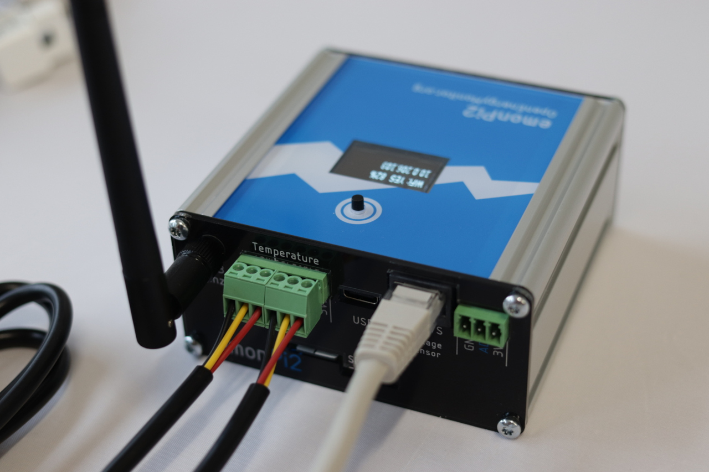
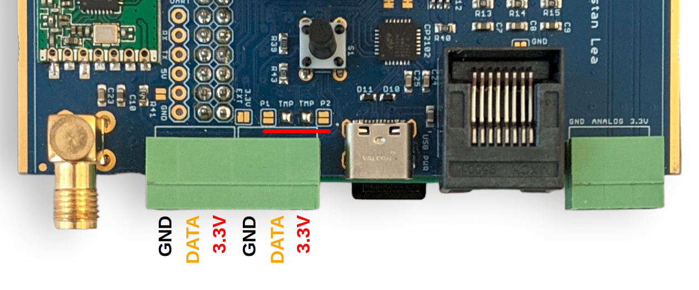
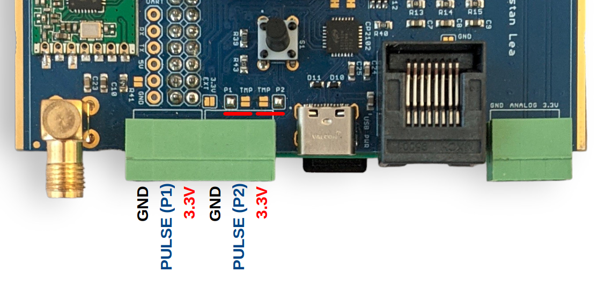
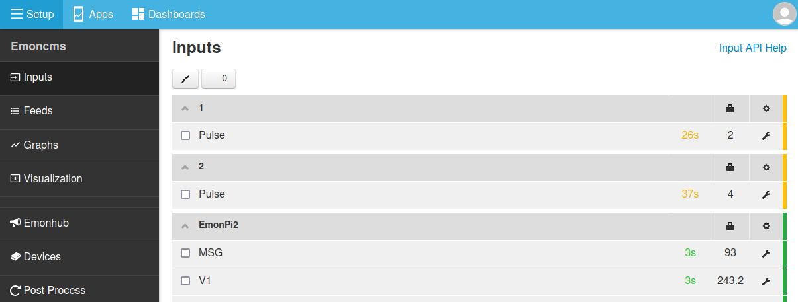

# Other sensors

## Temperature sensing

The emonPi2 supports temperature sensing via [DS18B20 temperature sensors](../electricity-monitoring/temperature/DS18B20-temperature-sensing.md). These are small temperature sensors with a 12-bit ADC and a digital output all in the sensor itself. Communication is over a one-wire bus and requires little in the way of additional components. The sensors have a quoted accuracy of ±0.5°C in the range -10°C to +85°C.

```{tip}
<b>Temperature sensing is handled by the RaspberryPi directly</b> rather than the measurement board microcontroller. This removes the hard limit on the number of temperature sensors that can be connected to the bus and allows sensor addresses to appear directly on the Emoncms inputs page. It also improves the accuracy of the electricity monitoring as the measurement board is freed up to focus soley on this task.

We have tested up to 6 temperature sensors connected at once, the one-wire bus should however support more than this. There is a useful discussion on how many sensors can be supported on a single RaspberryPi GPIO input [here](https://raspberrypi.stackexchange.com/questions/23701/what-is-the-maximum-number-of-ds18b20-probes-that-can-attached-to-one-input-port).
```

DS18B20 temperature sensors are connected via the labelled pluggable terminal blocks (multiple sensors can be connected to each temperature input, e.g using a 6x sensor breakout board). *Please note that temperature sensing is not broken out on the RJ45 connector which is for voltage sensing and power only.* 

**Pluggable terminal block connections are:**<br>
GND (black), DATA (yellow), 3.3V (red), left to right, repeated for each of the three blocks:



The function of the emonPi2 terminal blocks can be changed with small solder-jumpers just above the terminals on the measurement board PCB. The default configuration is 2x temperature sensor inputs, one on each terminal block. Notice the bridged solder jumpers labelled 'TMP' in the picture below: 



The DS18B20 input is connected to GPIO17 on the RaspberryPi via the GPIO connection header. *It is also connected to digital PIN_PB4 on the AVR128DB48 microcontroller for use in transmitter mode with the emonLibCM library only (not standard).*

## Pulse counting

While the left hand side terminal block inputs are configured for temperature sensing as standard, it's possible to change the function of the 'Data' pin on each of the terminal block inputs. The following picture shows both inputs configured for pulse counting rather than temperature sensing, notice the moved solder pad bridges:



```{note}
<b>T1</b> can be either a pulse input (<b>Pi GPIO27 PIN13</b> or AVR-DB PIN_PB5) or temperature sensing (<b>Pi GPIO17</b> or AVR-DB PIN_PB4)

<b>T2</b> can be either a pulse input (<b>Pi GPIO22 pin-15</b> or AVR-DB PIN_PC0) or temperature sensing (<b>Pi GPIO17</b> or AVR-DB PIN_PB4)
```

When running the standard emonPi2 single phase or three phase firmware pulse counting is handled by the EmonHub software running on the attached RaspberryPi. 

Add the following `emonhub.conf` interfacer configuration to enable reading on the applicable pulse inputs: 

```
[[pulse1]]
    Type = EmonHubPulseCounterInterfacer
    [[[init_settings]]]
        pulse_pin = 13
        # bouncetime = 2
        # rate_limit = 2
    [[[runtimesettings]]]
        pubchannels = ToEmonCMS,
        nodeoffset = 1

[[pulse2]]
    Type = EmonHubPulseCounterInterfacer
    [[[init_settings]]]
        pulse_pin = 15
        # bouncetime = 2
        # rate_limit = 2
    [[[runtimesettings]]]
        pubchannels = ToEmonCMS,
        nodeoffset = 2
```

On pulse detection, the pulse inputs will appear on the Emoncms inputs page:




