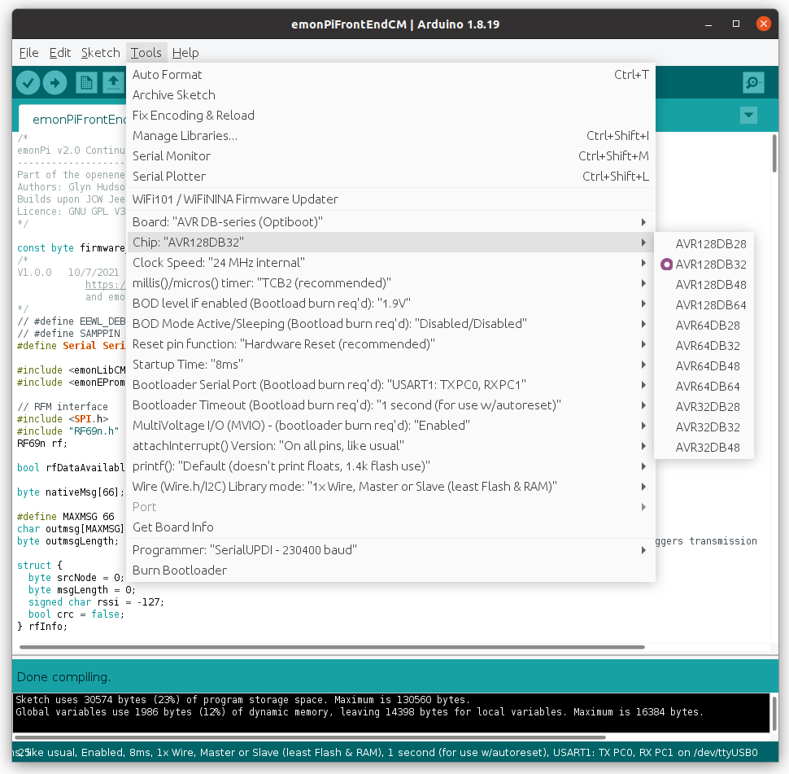

## Firmware

The emonPi2 firmware can be edited and compiled using the [Arduino IDE](https://www.arduino.cc/) with [DxCore installed](https://github.com/SpenceKonde/DxCore).
DxCore is an Arduino core for the AVR-DB microcontroller range, developed by SpenceKonde.

### Available Firmware

**[emonPi2FrontEndCM:](emonPi2FrontEndCM)** Single phase, 3 CT channel, continuous sampling, native RFM69 radio base-station firmware for the emonPi 2.

### Examples

The following examples test specific functionality and may be useful when developing new firmware or modifying existing.

**[rf69n_rxtx_test:](rf69n_rxtx_test)** Example of receiving and transmitting RFM69 native format radio data.

### Pre-compiled firmware:

Command line upload:

    sudo systemctl stop emonhub
    avrdude -Cavrdude.conf -v -pavr128db32 -carduino -D -P/dev/ttyAMA0 -b115200 -Uflash:w:emonPi2FrontEndCM.ino.hex:i 
    sudo systemctl start emonhub

### How to compile and upload firmware:

If you don’t already have the Arduino IDE it can be downloaded from here: 
[https://www.arduino.cc/en/software](https://www.arduino.cc/en/software)

Once you have the IDE installed, you then need to install [Spence Konde’s DxCore](https://github.com/SpenceKonde/DxCore). This can be done by first pasting the following board manager URL in Arduino IDE > File > Preferences:

    http://drazzy.com/package_drazzy.com_index.json

Then navigating to: *Tools > Boards > Boards Manager*, Select “DxCore by Spence Konde” and click Install. 

For more information on DxCore installation see: [https://github.com/SpenceKonde/DxCore/blob/master/Installation.md](https://github.com/SpenceKonde/DxCore/blob/master/Installation.md).

**Libraries**

1\. Download EmonLibCM library (avrdb branch) 
https://github.com/openenergymonitor/EmonLibCM/tree/avrdb

2\. Download emonEProm library (avrdb branch) 
https://github.com/openenergymonitor/emonEProm/tree/avrdb

3\. Download RF69n library (avrdb branch) 
https://github.com/openenergymonitor/rf69/tree/avrdb

4\. Install SSD1306Ascii OLED display library: 
https://www.arduino.cc/reference/en/libraries/ssd1306ascii

**Compilation settings:**

Under Tools, select the following configuration options:

- Select Chip: AVR128DB32
- Clock Speed: 24 MHz Internal
- Bootloader serial port: UART1: TXPC0, TXPC1

