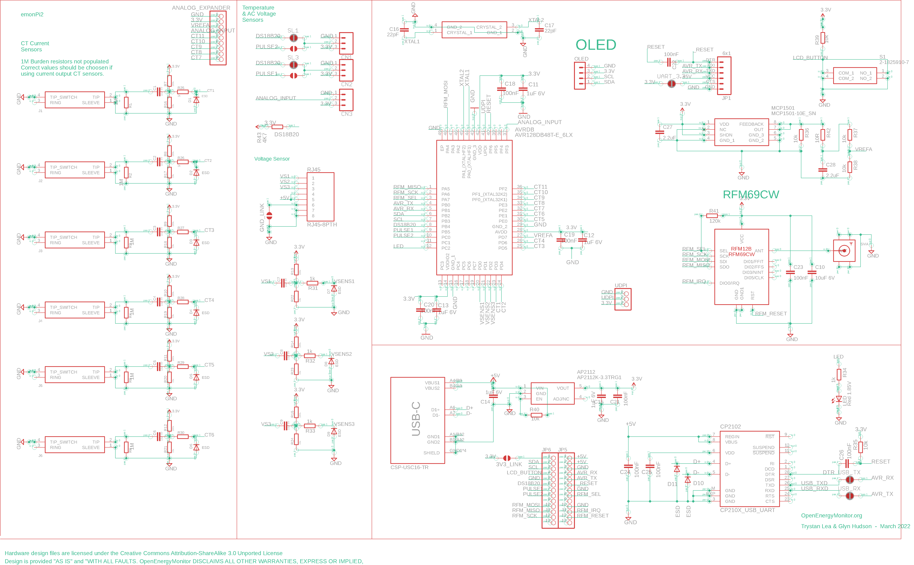
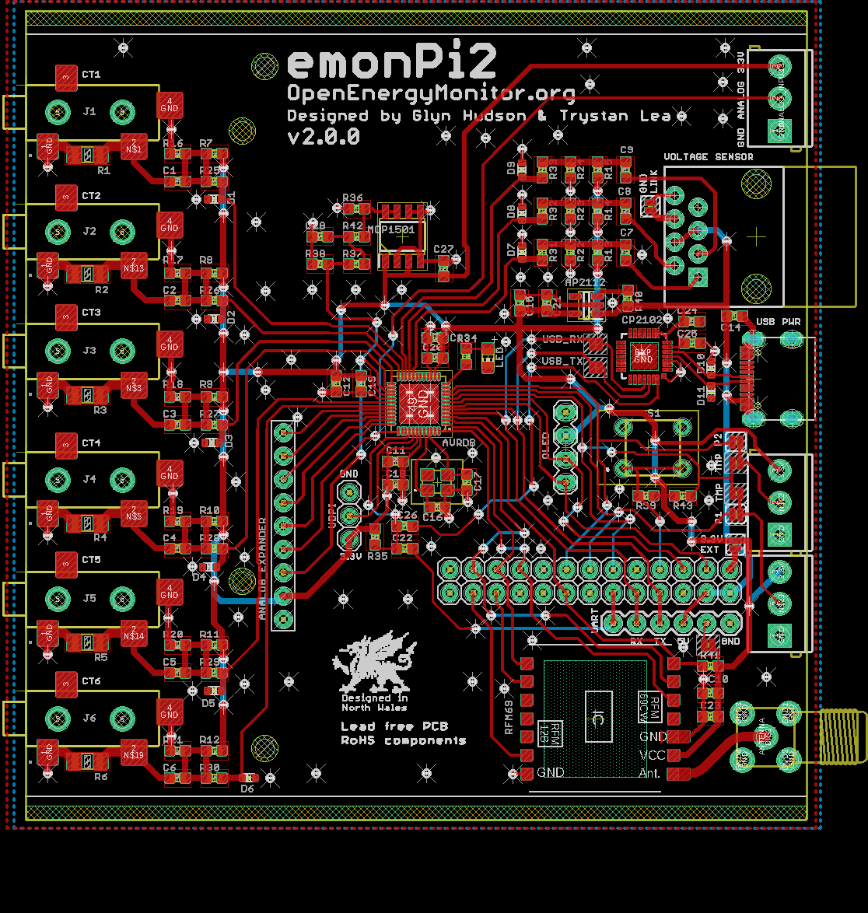

# emonPi2 - Hardware

The emonPi2 hardware schematics and board files have been developed using Eagle (now Autodesk). A free version is available to download here: https://www.autodesk.co.uk/products/eagle/free-download.

Alternatively it is also possible to open these board designs using KiKad which is open source.

**Schematic:**

**Board design:**

